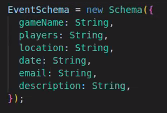

# funshare®
<<<<<<< HEAD
funshare® is an app to virtually connect board game lovers and allow them to meet and play in the real world! 
=======
funshare® is an app to virtually connect boardgame lovers and allow them to meet and play in the real world! :game_die: :mahjong: :black_joker: 
>>>>>>> readme updated with pics and some other minor updates

:pushpin: ## Getting started

- Install mongoDB 
- In app.js there is connection set up using mongoose and funshare collection is created

:pushpin: ## Dependencies

1. Run `yarn install` in project directory to install Express.`yarn start` to run servers on port 5001
2. `cd client` and `yarn install` to install React. `yarn start` to run servers on port 3000.

:pushpin: ## API 
Create a `.env` file
- visit https://opencagedata.com/, register and create your own API key
- create a variable REACT_APP_OCD_API_KEY=*** and replace the * with your own key

:pushpin: ## User Flow Diagram :ocean:

:pushpin: ## User Flow in Pics :twisted_rightwards_arrows:

:pushpin: ## Database schema

:pushpin: ## API routes plan

:pushpin: ## Used technologies

For authentication:
- Passport
- bcrypt 
- JWT

### Frontend

- React
- React Router
- Bootstrap - styling
- axios 
- leaflet - library for interactive map

### Backend

- Express - to create server and API routes
- Node.js - to run the server
- mongoose - communicate with mongoDb

### Database

- mongoDB 

## Future features :fast_forward:

- Deploy on Heroku
- User communication, direct messages or chat
- User can add avatar
- Geospatial data to find users in specific location/radious
- Using API for game recognition
- User can add event and it's saved to their DB Schema
- Map to show events from DB
- Recommended places friendly for playing boardgames
- Forum where people can ask questions

## The team

- Donatella Carta :ant:
- Gabriela Scorza :ant:
- Paulina Czybir :ant:

## Credit

_This is a student project that was created at [CodeOp](http://CodeOp.tech), a full stack development bootcamp in Barcelona._
